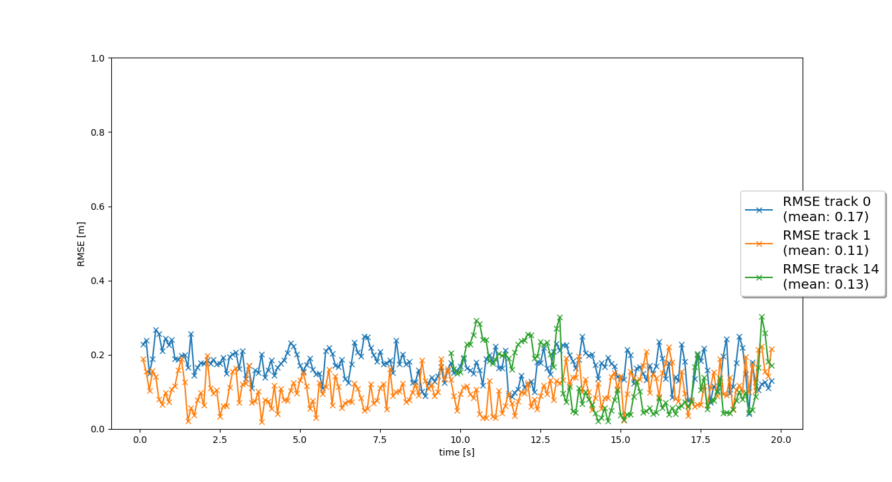

# Writeup: Track 3D-Objects Over Time

## Midterm Project

In the midterm project, we were asked to visualize LIDAR point cloud data and describe our findings. The sections below include observations from 6 different frames in the provided "Sequence 3".

### Common characteristics of each frame

There are a few common features and characteristics in each frame. For example, in the image below, the red annotation indicates cars moving in the same direction as us, while green annotations indicate vehicles in the opposing traffic lane. This image also shows different types of vehicles. For example, the vehicle labeled `1` is towing a trailer, while other vehicles are not. Also, vehicles that are further away (such as `4`) have relatively few points associated with them compared to vehicles that are closer (such as `9`). This could cause issues with detecting far away vehicles.

### Frame 0

In this frame, it is clear that there are multiple other vehicles in the scene. A noteworthy one is the truck towing a trailer (red box) just in front and to the right of our vehicle. This immediately makes me think of how we might treat this from an object detection point of view. The truck+trailer is clearly one vehicle, but the truck may be detected as its own vehicle without the trailer, and therefore have an incorrect bounding box.

There are a few bright spots in the intensity image, notably the license plate of the trailer (annotated with blue boxes in the intensity image).

#### Point cloud

#### Range and Intensity

### Frame 40

In this frame, we are beginning to overtake the truck with the trailer. Very prominent features (in terms of intensity) include road signs and vehicle tail lights. These are annotated with blue boxes in the intensity image.

#### Point cloud

#### Range and Intensity

### Frame 65

In this frame, the notable nearby bright spots in the intensity image include vehicle taillights and license plates. This makes me think about license plates as a feature - for example, certain states might produce less reflective license plates, which might cause issues if our detector was only trained in one or two states.

There is also a notable errant point in the point cloud just in front of the sensor. This is interesting - perhaps some dust, a bird, or a sensor error.

#### Point cloud

#### Range and Intensity

### Frame 100

In this frame, it is clear to see that reflectors embedded in the road produce strong lidar returns (highlighted by blue boxes in the image). This could be interesting for lane-keeping.

#### Point cloud

#### Range and Intensity

### Frame 145

In this frame, you can see two humans forward and to the left of the vehicle. They are wearing light colored clothing so they appear bright in the intensity image. They are annotated in red in the images below, with red arrows pointing toward them in the PCL image.

#### Point cloud

#### Range and Intensity

### Frame 195

In this frame, the two humans (again annotated in red) are close to the vehicle and therefore appear very bright in the intensity image. Signs on the side of the road also appear very bright.

#### Point cloud

#### Range and Intensity

## Final Project

### RMSE Plots

The instructions include a request to upload the RMSE plots for steps 1 through 3. I've included them below.

#### Step 1 - Tracking

#### Step 2 - Track Management

#### Step 3 - Data Association

#### Step 4 - Sensor Fusion

### 1. Write a short recap of the four tracking steps and what you implemented there (filter, track management, association, camera fusion). Which results did you achieve? Which part of the project was most difficult for you to complete, and why?

#### Step 1 - Tracking Filter

In Step 1, I implemented an (Extended) Kalman Filter that is capable of tracking a single target over time using the LIDAR sensor. This filter is limited to a single sensor, but was general enough to be extended to the camera sensor in future steps.

#### Step 2 - Track Management

In this step, I laid the groundwork for multi-target tracking by implementing some track management logic. This system adds new tracks when new measurements become available, and deletes tracks when they fall below certain pre-defined conditions. The system implemented in this step was only suitable for a single target though, since there was no association logic. However, that was created in the next step.

#### Step 3 - Data Association

This step involved associating measurements to existing targets using a simple single nearest neighbor approach. This approach is not globally optimal but was sufficient for tracking multiple targets in the given scene.

#### Step 4 - Sensor Fusion

This step pulled together all of the previous work to create a fully functional (albeit extremely simple) multi-target tracking sensor fusion module. This involved including camera measurements in addition to LIDAR measurements.

#### Overall thoughts

Overall, I think the most challenging aspect was the data association problem and keeping track of which measurements and tracks are associated and which ones are unassigned. There's a bit of record-keeping here which is crucial to implement well, since errors could have very bad results.

### 2. Do you see any benefits in camera-lidar fusion compared to lidar-only tracking (in theory and in your concrete results)?

Yes, there are certainly benefits to including camera and lidar measurements. Intuitively, using two diverse sensing modalities provides more information from varied underlying physical measurement mechanisms, which should nearly always provide better results in a perfect world. It becomes critical, though, to make sure these sensors are calibrated correctly and cross-calibration between the sensors has been validated, otherwise the results may actually be worse than a single sensor system.

In concrete results, you can see from the charts of Step 3 and Step 4 that incorporating the camera does improve the results for 2 of the tracks. Interestingly, the mean error for track 0 actually increased after adding the camera. While it's not clear exactly why this is the case, one possibility is that the camera detections for that particular vehicle did not agree very much with the lidar detections.

### 3. Which challenges will a sensor fusion system face in real-life scenarios? Did you see any of these challenges in the project?

Cross-calibration comes to mind as a first issue - it is critical to have a correct extrinsic calibration for each sensor and to validate this in test. Occlusions are another issue. If a car disappears behind another car momentarily, our brains know with confidence that it is still there, but this algorithm may eventually delete it. Context is important in this case (e.g. highway vs urban), so perhaps embedding some notion of context into the filter can be advantageous.

### 4. Can you think of ways to improve your tracking results in the future?

One potential path to explore is higher fidelity vehicle models. In this project, we assumed a constant velocity model, which does not really reflect the kinematics and dynamics of real cars. Something like a bicycle model would improve the prediction step, since it would encode more information about the vehicle's kinematics.

In addition, we could consider adding additional states to our filter. For example, we currently only track positions and linear velocities, but we could add orientation and angular velocities as well.

Improvements can also be made in the data association step. The current method is quite crude and could fail in certain situations (like congested roadway, lots of occlusions, etc.).
