# Writeup: Track 3D-Objects Over Time

## Midterm Project

In the midterm project, we were asked to visualize LIDAR point cloud data and describe our findings. The sections below include observations from 6 different frames in the provided "Sequence 3".

### Common characteristics of each frame

There are a few common features and characteristics in each frame. For example, in the image below, the red annotation indicates cars moving in the same direction as us, while green annotations indicate vehicles in the opposing traffic lane. This image also shows different types of vehicles. For example, the vehicle labeled `1` is towing a trailer, while other vehicles are not. Also, vehicles that are further away (such as `4`) have relatively few points associated with them compared to vehicles that are closer (such as `9`). This could cause issues with detecting far away vehicles.

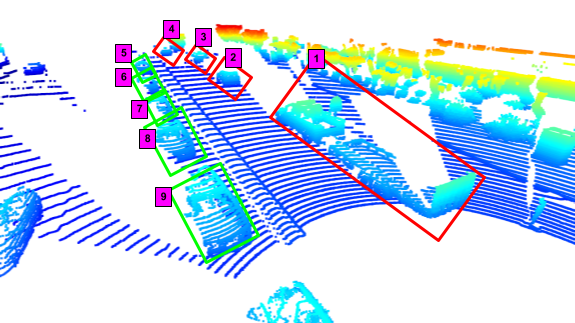

### Frame 0

In this frame, it is clear that there are multiple other vehicles in the scene. A noteworthy one is the truck towing a trailer (red box) just in front and to the right of our vehicle. This immediately makes me think of how we might treat this from an object detection point of view. The truck+trailer is clearly one vehicle, but the truck may be detected as its own vehicle without the trailer, and therefore have an incorrect bounding box.

There are a few bright spots in the intensity image, notably the license plate of the trailer (annotated with blue boxes in the intensity image).

#### Point cloud

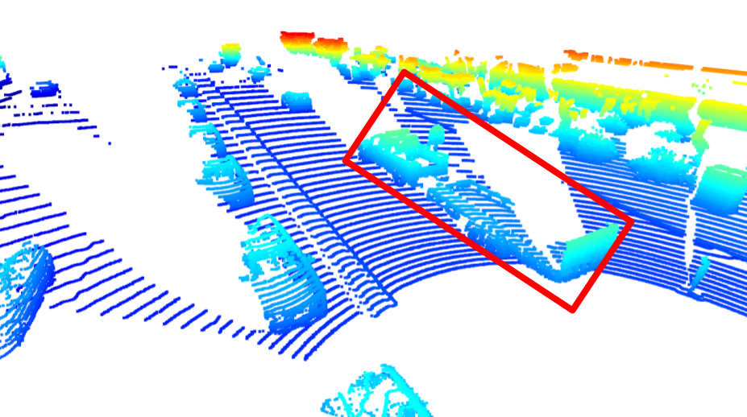

#### Range and Intensity

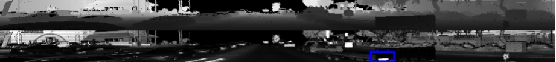

### Frame 40

In this frame, we are beginning to overtake the truck with the trailer. Very prominent features (in terms of intensity) include road signs and vehicle tail lights. These are annotated with blue boxes in the intensity image.

#### Point cloud

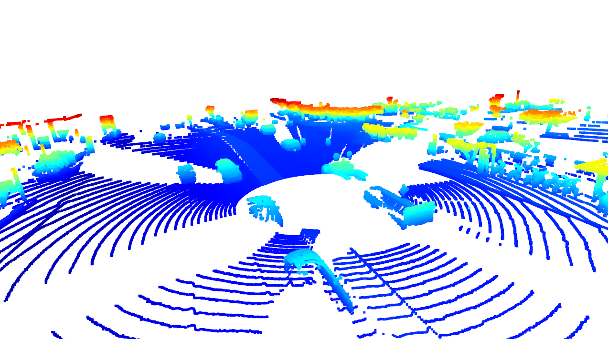

#### Range and Intensity

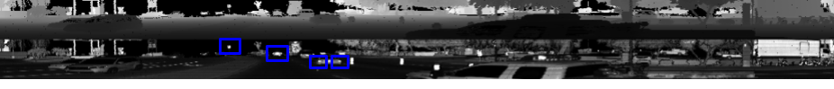

### Frame 65

In this frame, the notable nearby bright spots in the intensity image include vehicle taillights and license plates. This makes me think about license plates as a feature - for example, certain states might produce less reflective license plates, which might cause issues if our detector was only trained in one or two states.

There is also a notable errant point in the point cloud just in front of the sensor. This is interesting - perhaps some dust, a bird, or a sensor error.

#### Point cloud

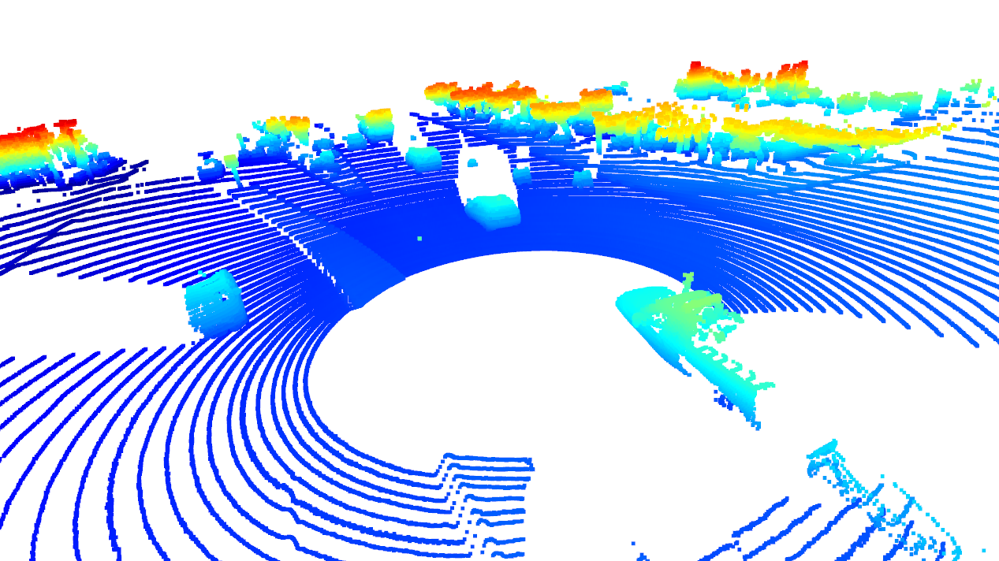

#### Range and Intensity

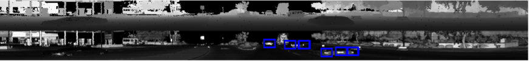

### Frame 100

In this frame, it is clear to see that reflectors embedded in the road produce strong lidar returns (highlighted by blue boxes in the image). This could be interesting for lane-keeping.

#### Point cloud

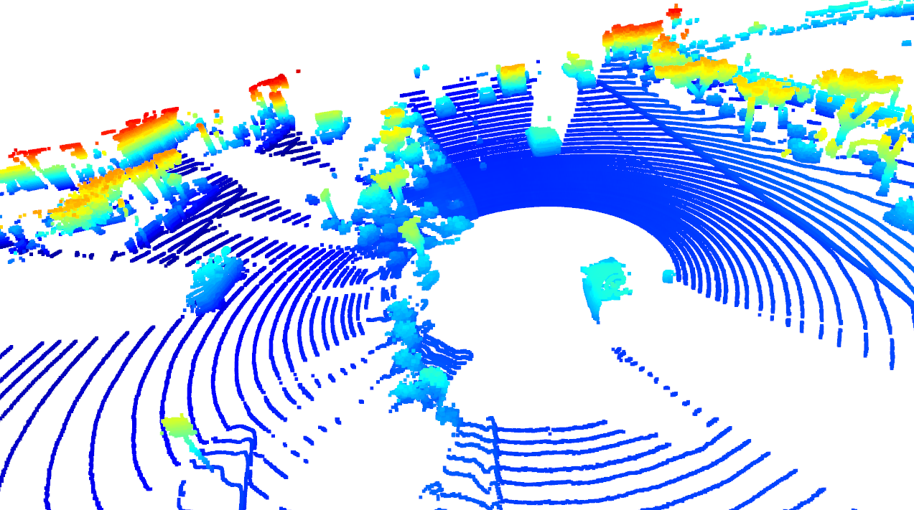

#### Range and Intensity

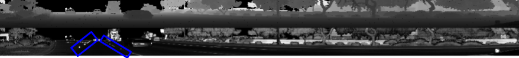

### Frame 145

In this frame, you can see two humans forward and to the left of the vehicle. They are wearing light colored clothing so they appear bright in the intensity image. They are annotated in red in the images below, with red arrows pointing toward them in the PCL image.

#### Point cloud

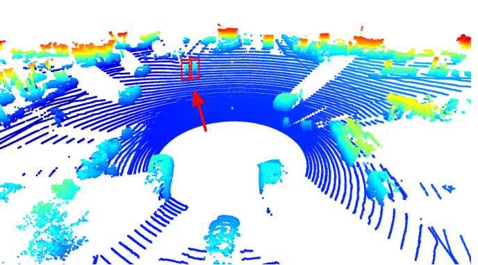

#### Range and Intensity

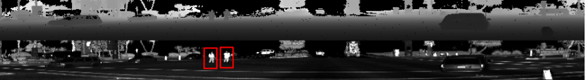

### Frame 195

In this frame, the two humans (again annotated in red) are close to the vehicle and therefore appear very bright in the intensity image. Signs on the side of the road also appear very bright.

#### Point cloud

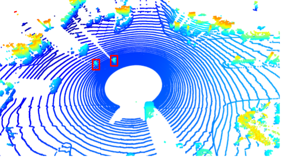

#### Range and Intensity

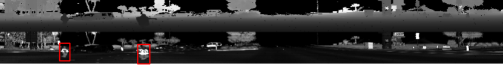

## Final Project

### RMSE Plots

The instructions include a request to upload the RMSE plots for steps 1 through 3. I've included them below.

#### Step 1 - Tracking

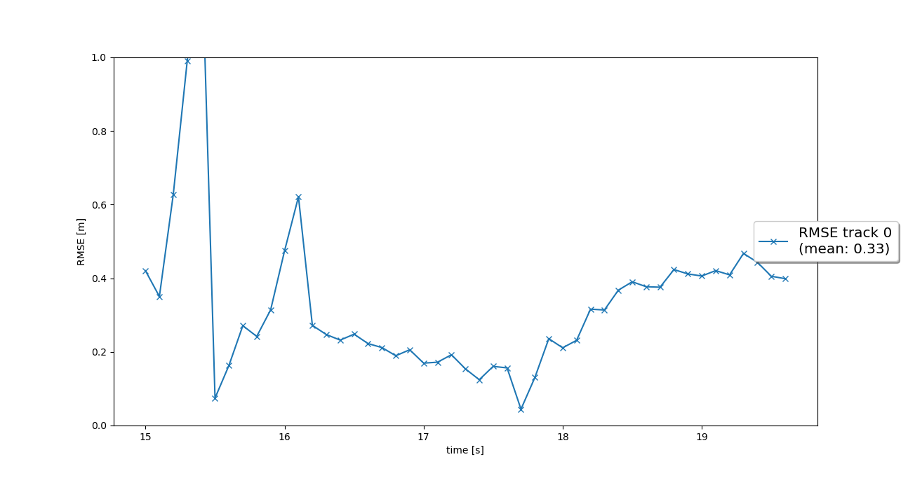

#### Step 2 - Track Management

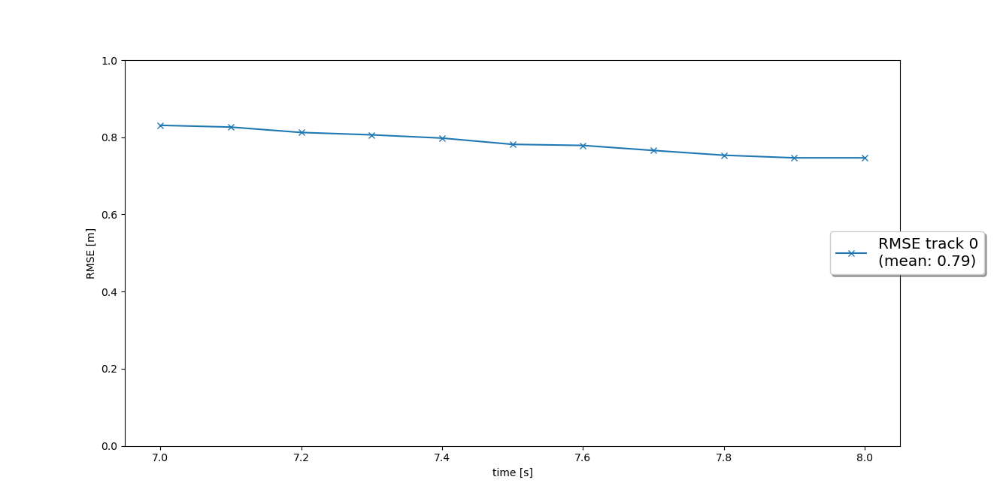

#### Step 3 - Data Association

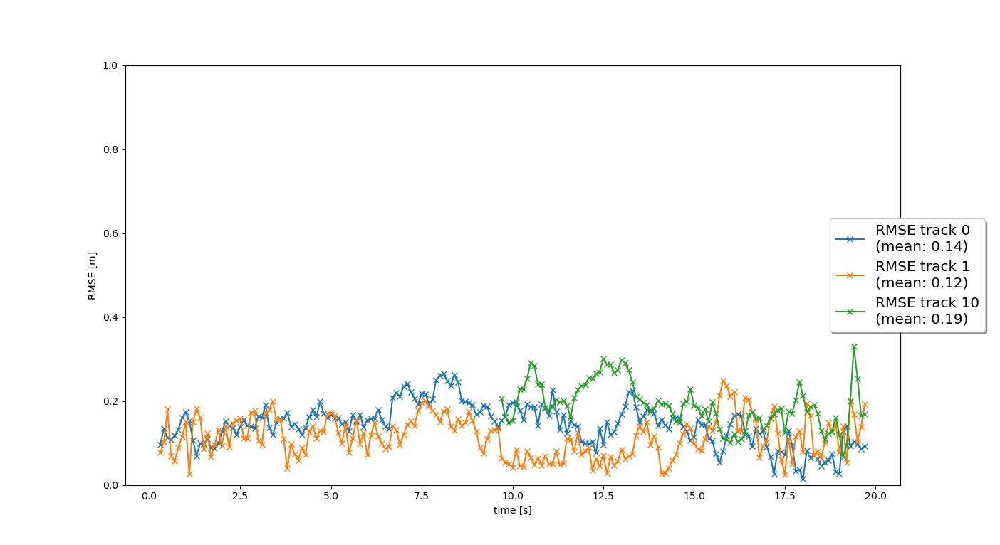

### 1. Write a short recap of the four tracking steps and what you implemented there (filter, track management, association, camera fusion). Which results did you achieve? Which part of the project was most difficult for you to complete, and why?

### 2. Do you see any benefits in camera-lidar fusion compared to lidar-only tracking (in theory and in your concrete results)? 

### 3. Which challenges will a sensor fusion system face in real-life scenarios? Did you see any of these challenges in the project?

### 4. Can you think of ways to improve your tracking results in the future?
